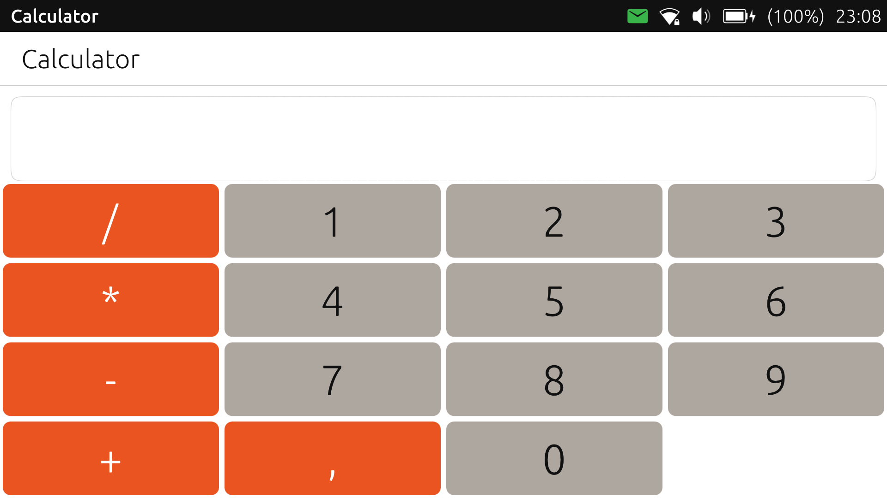
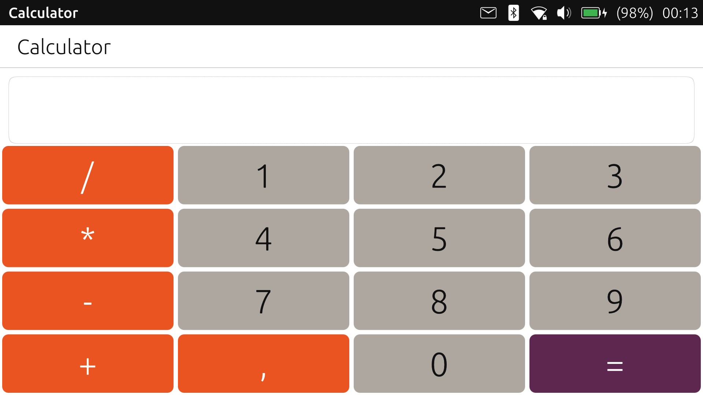
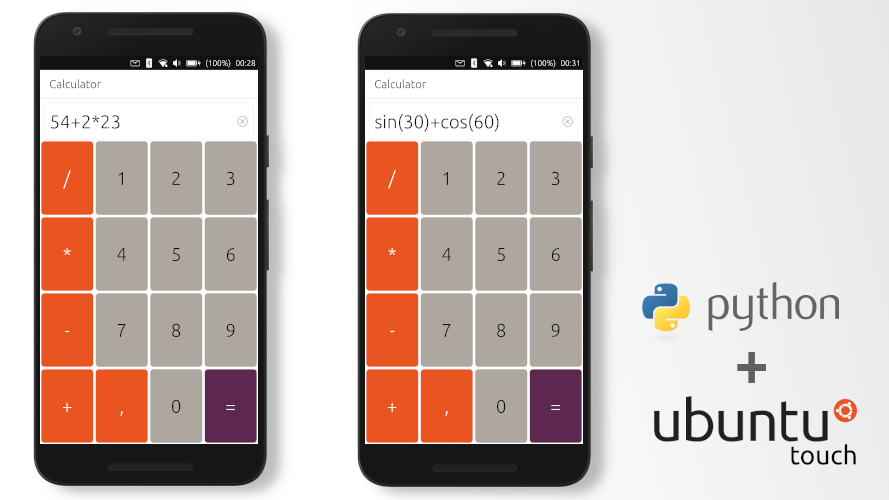

# Writing a Calculator on Python for Ubuntu Touch
[[статья на русском]](http://dtc1.ru/Пишем%20калькулятор%20на%20Python%20для%20Ubuntu%20Touch)
**Let's create a new project in Clickable**, enter the command in the terminal:
    
    clickable create
	
Select the Python project type and fill in: 
Title \[App Title\]: Calculator  
App Name \[appname\]: example-сalculator

Find Main.qml in the project folder and delete all unnecessary things - Python object, Label in Page.

The first thing we need is an input field for our calculator.

    TextField {
        id: textField
        text: ""
        
        property bool hasError: false
        font.italic: hasError
        anchors {
            topMargin: units.gu(1);
            top: header.bottom
            left: parent.left
            leftMargin: units.gu(1);
            right: parent.right
            rightMargin: units.gu(1);
        }

        height: units.gu(8)
        font.pixelSize: units.gu(4)
        }
		
So that our text box does not overlap the title in **anchors** we set the alignment **top: header.bottom**.
Need remebmer that different devices have different display resolutions, so you must always specify the relative size, the **units.gu (1)** property will help us with this.
The result of the program may be with errors (division by zero), for this we will declare the property bool hasError, which in case of an error will make the font italic (**font.italic: hasError**).

Now let's create buttons \- in the **qml** folder create a **alculatorButton.qml** file:

    import QtQuick 2.7
    import Ubuntu.Components 1.3

    Rectangle {
        signal clicked 
    
        color: "#AEA79F"
        radius: units.gu(1)
        border.width: units.gu(0.25)
        border.color: "white"
		
		property alias text: label.text    
        property alias color_text: label.color
        Label {
            id: label
            font.pixelSize: units.gu(4)
            anchors.centerIn: parent
            color: "#111"
        }
    
        MouseArea {
            id: mouseArea
            anchors.fill: parent
            onClicked: parent.clicked()
        }
    }

Button is a regular rectangle and it cannot interact in any way (*perform the function of a button*). To fix this, let's declare the **clicked** (*signal clicked*) signal.
To create this event, let's create a **MouseArea**. Set up wrapping around the parent (*anchors.fill: parent*) and passing the clicked event to the parent (*onClicked: parent.clicked ()*)
We also created 2 properties for our object - text (*to change the text*) and color_text (*to change the font color*)

We import this into our main project Main.qml, add in the header **import "./"**

There are many buttons in our calculator and they are of the same type.

    / 1 2 3
    * 4 5 6
    - 7 8 9
    + , 0 =

Create a 4x4 mesh layer.
In order to create buttons of the same type, let's add a Repeater by the model ("/", 1, 2, 3, "*", 4, 5, 6, "-", 7, 8, 9, "+", ",", 0)

    Grid {
    anchors { 
        top: textField.bottom
        left: parent.left
        right: parent.right
        bottom: parent.bottom
        }
    columns: 4
    rows: 4
    Repeater {
        model: ["/", 1, 2, 3, "*", 4, 5, 6, "-", 7, 8, 9, "+", ",", 0]
        delegate: CalculatorButton {
        text: modelData.toString ()
        height: parent.height / parent.rows
        width: parent.width / parent.columns
        color: {
		    if ((index % 4 == 0) || (modelData.toString() == ","))
                {
                color_text = "white"
                return "#E95420"
                } else {
                return "#AEA79F"
                }
            }
        }
    }
	
On each button, we change the text by assigning it **modelData.toString ()** (repeater item). We can also get the index of the repeater element through the **index** property.
For better display, change the color of the button, according to the rule *if the remainder of division by 4 is 0 or the content of the element matches ","*, then change the color of the button to # E95420 and the text color to white.
We get:

Now to add the "=" button. After the repeater, add:

    CalculatorButton {
        text: "="
        color: "#5E2750"
        color_text : "white"
        height: parent.height / parent.rows
        width: parent.width / parent.columns
    }
	

Connect Python:

    Python {
        id: python
        
        Component.onCompleted: {
            addImportPath(Qt.resolvedUrl('../src/'));
            importModule_sync("example")
        }

        onError: {
            console.log('python error: ' + traceback);
        }
    }
	
Let's add processing to our code. Add an event to the Repeater - onClicked:

    Repeater {
    ...
        delegate: CalculatorButton {
        ...
            onClicked: textField.text += modelData.toString()
        ...
        }
    }
	
When the button is clicked, we will add the corresponding character to our string. Now let's connect the execution of the math string. Add an event to the button:

    CalculatorButton {
        ...
        onClicked: {
        python.call("example.calculate", [ textField.text ], function ( result ) {
                var isValid = result[0];
                if (isValid) {
                textField.hasError =false
                textField.text = result[1];
                } else {
                textField.hasError =true  
                }
            })
            }
		...
    }

Now let's launch our application:

This calculator is capable of more than 2 + 2. To calculate more complex functions, you can enter them in the input line.